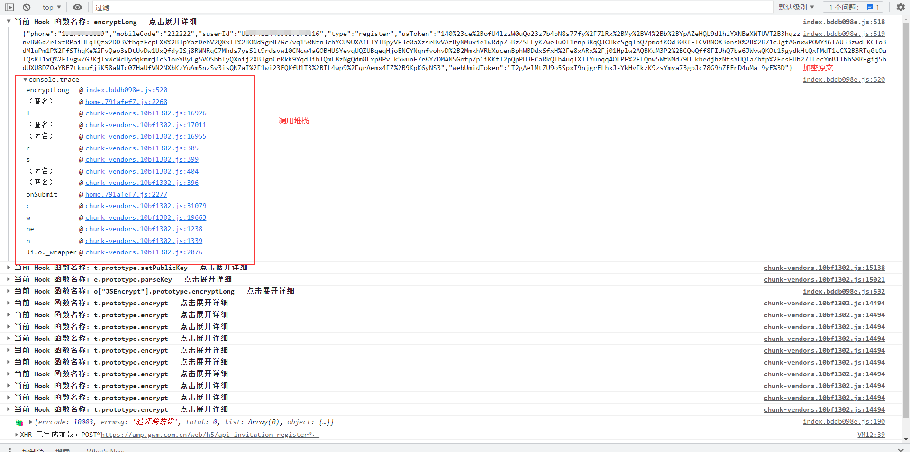
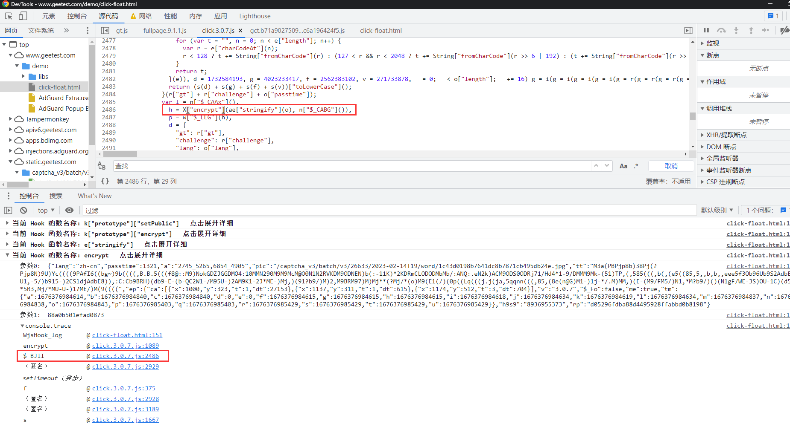
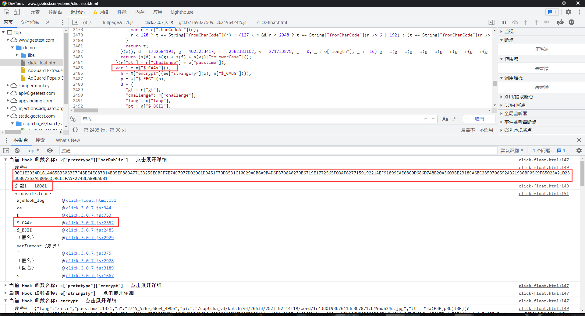

# 网页算法动态插桩工具（Js逆向）

## 一、 功能

1. 通过 ``anyproxy``工具拦截浏览器的请求 并通过``AST``  获取相关加密字段的``函数`` 进行插桩  输出相关的内容

2. 目前 测试 通过 的算法 有 ``AES`` `` DES``  ``3DES``  ``MD5``  ``SHA1``  ``SHA3``  ``SHA224``  ``SHA256``  ``SHA384``  ``SHA512``  ``RIPEMD160``  ``HMAC系列``  ``PBKDF2``  ``EvpKDF``  ``RSA``

3. **增加插件功能 可以按照自己的需要 处理JS 文件 然后在进行替换**

4. 并没有大批量测试  有bug 很正常

## 有问题请联系 QQ 2035776757    [视频教程](https://www.bilibili.com/video/BV1Q84y1H72j/?vd_source=90380208985bfbe80c682a5257e9ecf6)

## 二、安装

### nodejs 版本要求 

**个人使用的是  ``18.12.1``  全版本应该是没问题的**

### 将项目克隆到本地

```shell
git clone https://github.com/Liangliang0107/wjshook.git
cd /wjshook
```

### 安装项目依赖

```shell
npm install
```

### 无法安装依赖或者安装报错请手动执行以下命令

```shell
npm install anyproxy
npm install @babel/generator
npm install @babel/parser
npm install @babel/traverse
npm install @babel/types
```

## 三、启动项目

**默认代理端口是 ``1234 ``需要修改 请编辑 ``main.js`` 中的 ``options.port`` 字段**

**默认web端口是 ``8002 ``需要修改 请编辑 ``main.js`` 中的 ``options.webInterface.webPort``字段**

```shell
let options = {
    port: 1234,
    rule: {},
    webInterface: {
        enable: true,
        webPort: 8002
    },
    throttle: 10000,
    forceProxyHttps: true,
    wsIntercept: false,
    silent: false
}
```

**开启debugger插桩 方便调试  修改 ``payload.js`` 中的  ``Debug  = true`` 即可**

### 1. 安装证书

#### Windows： /User/你的用户名/.anyproxy/certificates 中

#### Android/IOS：打开web管理界面----RootCA----使用手机扫描二维码即可

### 2. 启动

```shell
node ./main.js -i
```

#### 下面就可以愉快的调试JS了

 


## 四、插件功能

```javascript
function exp(JsCode){
    JsCode +="Console.log('我是插件功能')"
    return JsCode;
}
module.exports = {
    url: "",  // 针对某个url生效  填空 全部生效
    exp: exp  // 这个exp是 处理函数 
}
```

#### 插件功能调试极验滑块/点选   可以看到 加密方法的 参数全部导出了  还有key之类的 这个为我们剩下了很多 找key的时间





# 【转载声明】转载请注明原始出处和作者

